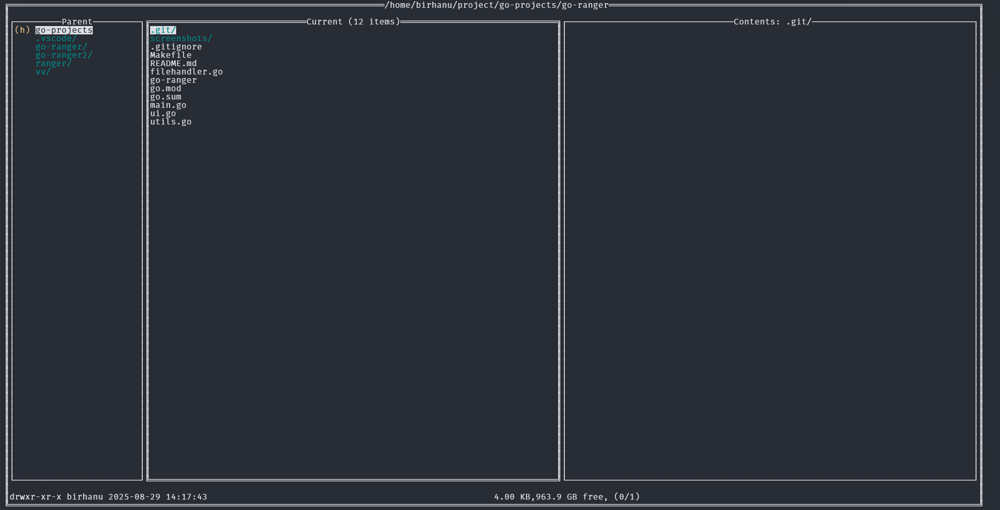

# 🚀 go-ranger

A simple, terminal-based file manager inspired by **ranger**, written in Go. This is my first Go project that brings the power of ranger-like navigation with a minimalistic approach.

## ✨ Screenshots

<div align="center">

| Ubuntu Interface | File Preview |
|:---:|:---:|
|  |  |
| *go-ranger running on Ubuntu* | *File preview functionality* |

| Directory Preview | File Operations |
|:---:|:---:|
|  |  |
| *Directory list on preview window* | *Creating new file/directory* |

| Delete Confirmation | 
|:---:|
|  | 
| *Deleting file/directory dialog* |

</div>


## ✨ Features

- **📁 File Navigation**: Intuitive keyboard-based navigation
- **🎨 TUI Interface**: Clean terminal user interface with colors
- **🔍 Quick Preview**: Basic file information and preview
- **📋 Basic Operations**: Create, delete files and directories
- **⚡ Lightweight**: Single binary, no dependencies required

## 🎯 Current Implementation

### ✅ Implemented Features
- **Navigation**: `j`/`k` for down/up, `h`/`l` for left/right
- **File Operations**: Create/delete files and directories
- **Basic Preview**: File size, type, and permissions display
- **Cross-platform**: Works on Linux, Windows, and macOS
- **Simple UI**: Clean interface with color coding

### ⌨️ Basic Shortcuts
- `j`/`k` - Navigate down/up
- `h`/`l` - Navigate left/right (directory navigation)
- `Enter` - Open file/directory
- `q` - Quit application
- `d` - Delete file/directory
- `n` - Create new file and for creating directory finish file name with /
-

## 🚀 Future Enhancements

### 📝 Planned Features
- **📄 File Editing**: Open files in text editors (Vim, Nano, VSCode)
- **📋 File Operations**: Copy, move, and rename files
- **🎨 Syntax Highlighting**: Color syntax in preview window
- **🔍 Search Functionality**: Find files by name/content
- **📊 File Information**: Detailed metadata and permissions
- **🖼️ Media Preview**: Image and document preview support
- **⚙️ Configuration**: Customizable keybindings and themes
- **📚 Plugin System**: Extensible functionality through plugins

### ⌨️ Additional Shortcuts Planned
- `y` - Yank (copy) file
- `p` - Paste file
- `r` - Rename file
- `/` - Search files
- `:` - Command mode
- `Space` - Select multiple files
- `v` - Visual selection mode

### 🌟 Advanced Features
- **Tabs Support**: Multiple directory tabs
- **Bookmarks**: Save frequently accessed directories
- **Archive Support**: Zip/tar file handling
- **Remote Files**: SSH/SFTP integration
- **Batch Operations**: Process multiple files at once
- **Theme Support**: Custom color schemes

## 📦 Installation

### Prerequisites
- **Go 1.21+** (for building from source)
- **Terminal** with UTF-8 support recommended

### Linux/Ubuntu Installation

#### Method 1: Quick Install (using make)
```bash
git clone https://github.com/GutemaG/go-ranger.git
cd go-ranger
make install
go-ranger #run
```